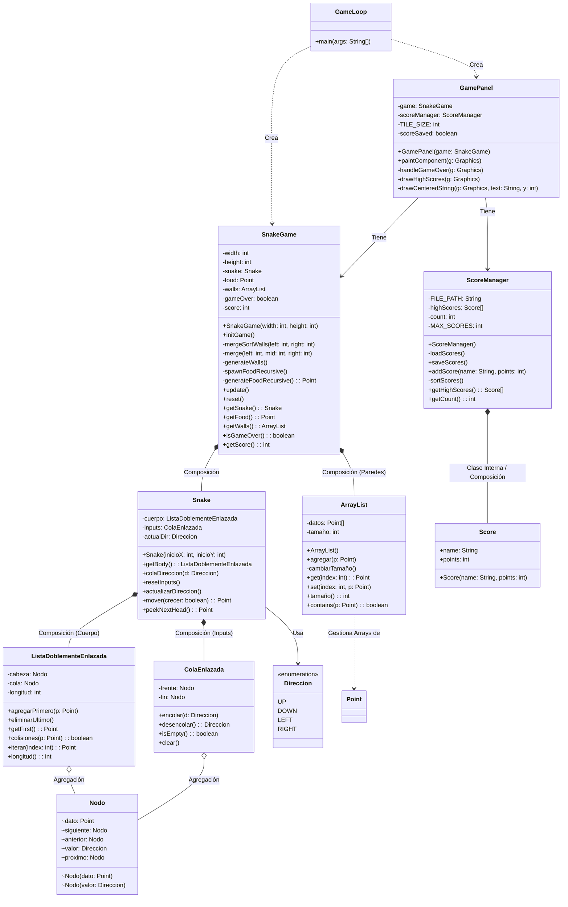

# Proyecto-Estructura

# Proyecto Final: Snake Game (Implementación Manual de Estructuras)

Asignatura: SIS-211 Estructuras de Datos<br>

Participantes:
- Ricardo Tomas Camacho Montalvo
- Luis Marcel Murillo Ulloa
- Luis Rubén Zelaya Rivera
<br>
Fecha: 15/12/2025

# Descripción del Proyecto

Este proyecto consiste en el desarrollo del clásico juego "Snake" utilizando el lenguaje de programación Java. El objetivo principal no es solo la recreación del juego, sino la implementación manual de las estructuras de datos fundamentales y algoritmos de gestión, prescindiendo de las colecciones nativas de Java (`java.util.List`, `java.util.LinkedList`, etc.) para demostrar la comprensión teórica y práctica de la asignatura.

El sistema cuenta con una interfaz gráfica (GUI) construida con Swing, sistema de puntuación persistente y manejo de colisiones.

# Características Técnicas

Lenguaje: Java (JDK 17 o superior recomendado).
Interfaz Gráfica: Java Swing (`JPanel`, `JFrame`, `Graphics`).
Persistencia: Archivos de texto (`scores.txt`) para guardar los puntajes altos.

# Estructuras de Datos Implementadas (Requisito: Mínimo 3)

Se han implementado manualmente tres estructuras de datos clave para el funcionamiento del motor del juego:

1. Lista Doblemente Enlazada (`ListaDoblementeEnlazada.java`)

- Uso en el juego: Gestiona el cuerpo de la serpiente.
- Justificación: El movimiento de la serpiente requiere insertar constantemente una nueva "cabeza" y eliminar la "cola" antigua. Una lista doblemente enlazada permite operaciones de inserción al inicio y eliminación al final con una complejidad de $O(1)$.
- Funcionalidad clave: Permite iterar sobre los nodos para detectar colisiones del cuerpo consigo mismo.

2. Cola Enlazada (`ColaEnlazada.java`)

- Uso en el juego: Buffer de entrada de teclado (Input Buffer).
- Justificación: Para evitar conflictos cuando el usuario presiona teclas muy rápido (más rápido que la actualización del juego), las direcciones se almacenan en una cola (FIFO). Esto asegura que cada movimiento se procese en orden y previene errores lógicos (como girar 180° instantáneamente).

3. Arreglo Dinámico (`ArrayList.java`)

- Uso en el juego: Almacenamiento y gestión de las paredes (obstáculos) del nivel.
- Justificación: Se necesitaba una estructura indexada que pudiera crecer dinámicamente si se decide agregar más niveles o muros. Implementa lógica de redimensionamiento (`resize`) cuando el arreglo interno se llena.

# Algoritmos Implementados

1. Algoritmos de Ordenamiento

Merge Sort (Recursivo): Implementado en la clase `SnakeGame`. Se utiliza para ordenar las coordenadas de las paredes (`walls`) basándose en su posición en el eje X. Esto prepara los datos para futuras optimizaciones de búsqueda o renderizado.
Bubble Sort (Iterativo): Implementado en `ScoreManager`. Se utiliza para ordenar la lista de puntajes altos (High Scores) de mayor a menor antes de guardarlos en el archivo.

2. Algoritmo Recursivo

Generación de Comida (`spawnFoodRecursive`): Se utiliza recursividad para colocar la comida en el tablero. Si la posición aleatoria generada colisiona con una pared o con el cuerpo de la serpiente, el método se llama a sí mismo nuevamente hasta encontrar una posición válida.

# Arquitectura del Proyecto

El proyecto sigue una estructura modular separada por paquetes:

## Arquitectura del Proyecto

El proyecto sigue una estructura modular separada por paquetes:

```text
JuegoSnake/
├── src/
│   ├── direccion/
│   │   └── Direccion.java
│   │
│   ├── estructuras/
│   │   ├── ArrayList.java
│   │   ├── ColaEnlazada.java
│   │   ├── ListaDoblementeEnlazada.java
│   │   └── Nodo.java
│   │
│   ├── juego/
│   │   ├── GameLoop.java (Clase Main)
│   │   └── GamePanel.java
│   │
│   ├── score/
│   │   └── ScoreManager.java
│   │
│   └── snake/
│       ├── Snake.java
│       └── SnakeGame.java
│
├── scores.txt (Se creará automáticamente al guardar puntaje)
└── README.md
```
# Diagrama de Clases


# Cómo Ejecutar el Proyecto

Opción 1: Desde un IDE (Eclipse, IntelliJ, NetBeans)

1.  Importar la carpeta del proyecto como "Java Project".
2.  Ubicar el archivo `juego/GameLoop.java`.
3.  Ejecutar el archivo (`Run as Java Application`).

Opción 2: Desde la terminal

Compilar todos los archivos desde la carpeta raíz `src`:

bash
javac juego/_.java snake/_.java estructuras/_.java direccion/_.java score/\*.java

Ejecutar la clase principal:

bash
java juego.GameLoop

# Controles

- Flechas de Dirección: Mover la serpiente (Arriba, Abajo, Izquierda, Derecha).
- Enter: Reiniciar el juego cuando aparece la pantalla de "Game Over".

# Lista de Verificación (Entregables)

- Repositorio en GitHub/GitLab.
- README con descripción y dependencias.
- Código fuente organizado por paquetes.
- Implementación manual de 3 estructuras de datos.
- Implementación de MergeSort y Recursividad.
